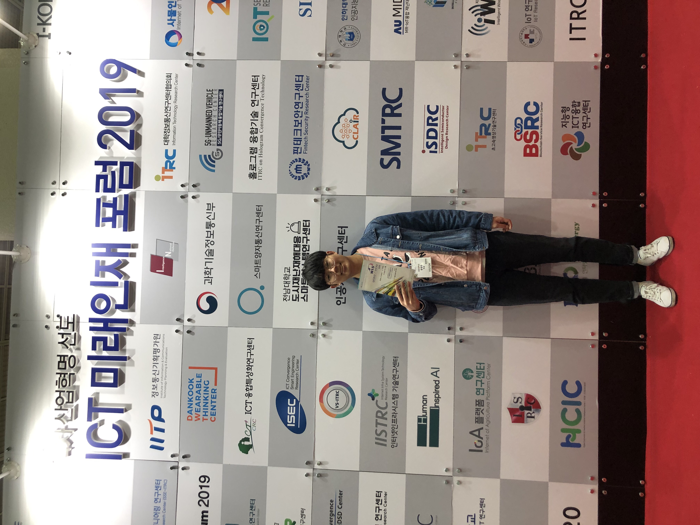

지난 4월 27일, 강남 코엑스에서 열린 국내 최대규모 ICT 전시회, World IT Show에 다녀왔다.  World IT Show는  '모바일 & 커뮤니케이션', 'ICT 디바이스', '디지털콘텐츠 스마트 미디어', '가전 & 홈어플라이언스', '융합 서비스', '보안기술 및 제품' 등 분야의 국내외 ICT 주요기업들의 최신 제품과 신기술을 선보이는 전시회로 2008년 부터 개최되었다고 한다. 규모가 상당히 커서 코엑스의 홀을 2개나 사용했는데, A홀과 C홀로 나뉘어 진행했다. 
A홀은 주로 대학 연구팀과, 중소기업으로 보이는 업체에서 부스를 운영하고 있었다. 나도 과거에 몇번 부스를 운영한 적이 있는데, 그때가 생각났다.  그때도 쉬는 시간에 다른 부스 관람을 종종 다녔는데, 주제가 비슷하기 때문인지, 예전에 본 것과 유사한 부스가 많이 있었다. 그 중에는 우리 학교에서 나온 연구팀도 있었는데, 휴먼 IoT 서비스 그룹에서, 인공지능, 클라우드 응용 기술을 융합해 삶의 질을 향상시키기 위한 IoT 디바이스와 서비스를 전시하고 있었다. 
C홀은 여러 중견기업과, SK,T KT와 현대 모비스 등 대기업이 부스를 운영하고 있었고, 관련 주제의 세미나가 진행되고 있었다. 대기업의 경우 확실히 돈이 많기 때문에 부스가 화려했는데, 주로 VR, 4D, 얼굴 나이 측정 등 흥미를 유발하기 좋은 것들 위주였다. SKT 부스에 주행 트랙이 보여서 자율주행 자동차를 시연하나 기대했으나, 흥미 유발을 위한 카트 부스여서 아쉬웠다. 
부스를 관람하며 의아했던 점은 기술적인 내용을 얻기 어려웠다는 점이다. 설명을 듣고 궁금한 부분에 대해 질문을 하니, 굉장히 잘 안다며 놀라워 하길래, 전공자가 아닌 일반인으로 보여서 그렇다고 생각했었는데, 조금 더 디테일한 질문을 하자 질문을 알아듣지 못하기 시작했다.  담당자의 명함을 주며 자세한 내용은 이쪽 이메일에 물어보면 될 것 같다고 했다. 아마 부스를 운영하던 사람들은 연구&개발자가 아니고,  교육받은 홍보부 사원이였던 것 같다. 생각해보면 연구&개발자가 나와서 부스를 운영하는 것은 효율적이지 못한 것 같기도 하지만 아쉬운 것은 어쩔수 없다. 
